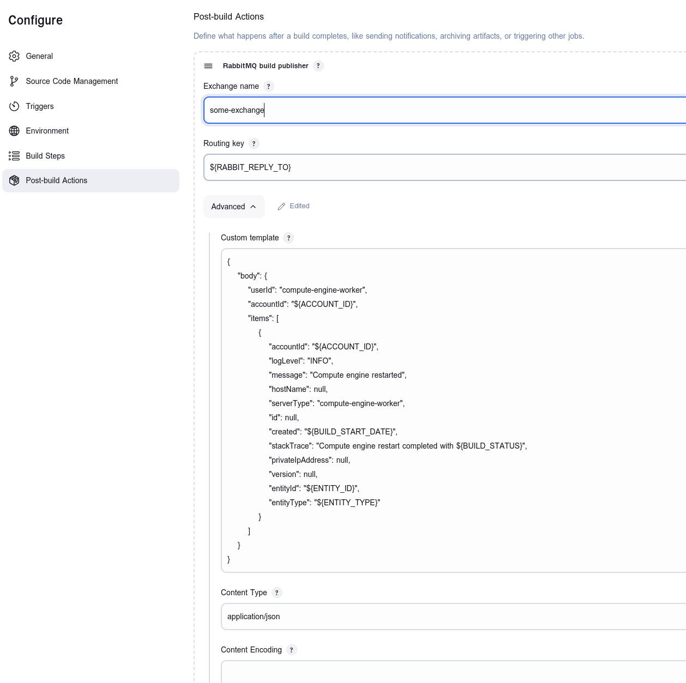
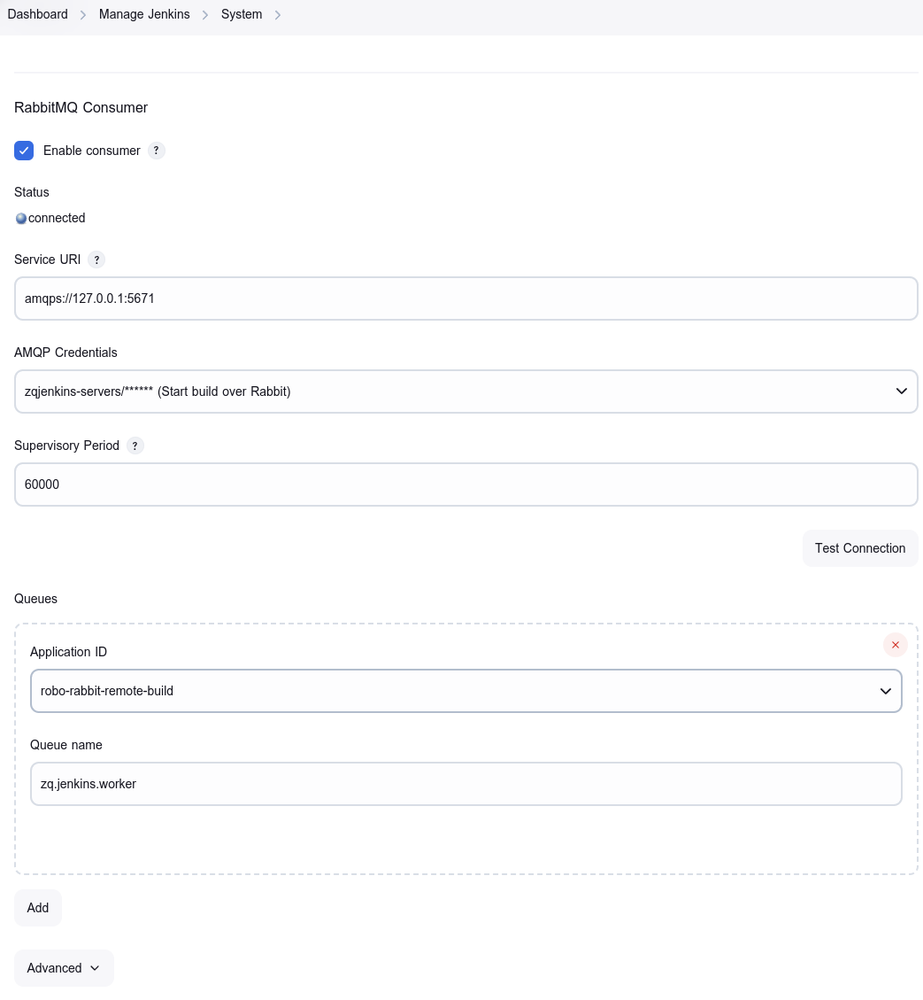
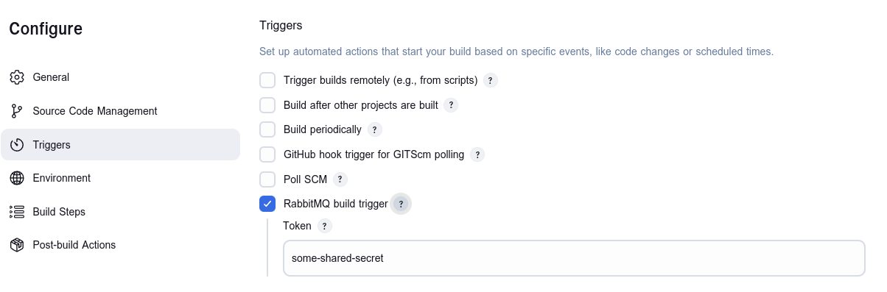
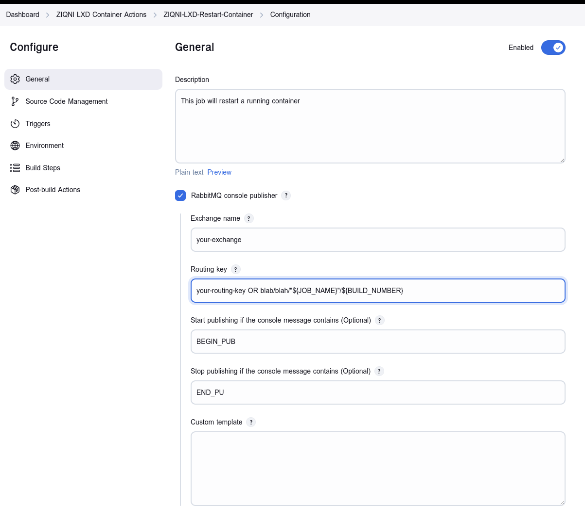
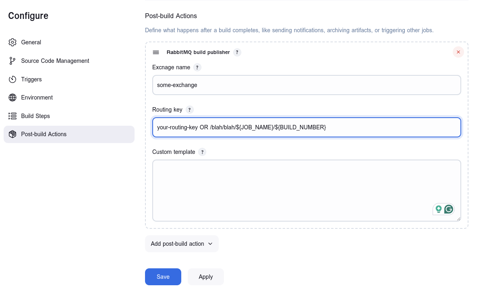

Jenkins RabbitMQ Integration
=======================================================

* Author: [ZIQNI][ziqni-web]
* Repository: https://github.com/ziqni-tech/jenkins-rabbit-integration-plugin
* Plugin Information: https://github.com/ziqni-tech/jenkins-rabbit-integration-plugin

[ziqni-web]: https://www.ziqni.com

### Attribution for derivative work
This work is based on the "RabbitMQ Consumer and Build Trigger Plugin for Jenkins" by © 2013 rinrinne a.k.a. rin_ne, licensed under the MIT License.

Modifications have been made to extend the functionality, improve integration, and adapt the plugin for additional use cases and improved credential management.

Overview
------------------------
The Jenkins RabbitMQ Integration plugin is used for 
* consuming messages
* triggering builds 
* publishing build results, and 
* publishing selective console output

The RabbitMQ Consumer plugin connects Jenkins to RabbitMQ, allowing it to consume application messages from specific queues.

Developers can develop additional plugins to extend user-specific functionality, see below.

Reason for development
------------------------
The RabbitMQ Consumer and Build Trigger Plugin was developed to provide a comprehensive solution for integrating RabbitMQ with Jenkins. 
By including all the main build features, this plugin simplifies the process of setting up RabbitMQ with Jenkins, making it a convenient, one-step installation for users. 
It utilizes the latest libraries and the new Jenkins architecture to ensure seamless integration and improved performance, providing a modern, streamlined experience.

Better templating for everyone, and more freedom to match user needs.



Features
------------------------
* Consumes application messages from specific queues
* Provides interfaces for listening to application messages
* Triggers builds based on application messages (Optional)
* Publishes console output to RabbitMQ (Optional)
* Publishes build results to RabbitMQ (Optional)

Important notes
------------------------
* This plugin **does not** create any queues in RabbitMQ. You need to set them up manually.

---

[Global] Consumer configuration
------------------------

___Before you begin, you need to add your RabbitMQ username and password to the Jenkins credentials store___.

To configure the consumer, go to *Jenkins > Manage Jenkins > Configure System > RabbitMQ Consumer*.

Here you can set the RabbitMQ server URL, username, password, and other settings.


---
Build environment variables
------------------------

#### RabbitMQ Message Properties

This section describes the properties that are extracted and made available by the RabbitMessageProperties class.

These properties correspond to various metadata fields related to messages received from a RabbitMQ queue.

#### Basic RabbitMQ Message Properties
* ${RABBIT_QUEUE_NAME}: The name of the queue from which the message was received.
* ${RABBIT_EXCHANGE}: The name of the exchange through which the message was routed.
* ${RABBIT_ROUTING_KEY}: The routing key used to deliver the message.
* ${RABBIT_DELIVERY_TAG}: A unique identifier for the message delivery.
* ${RABBIT_REDELIVERED}: A flag indicating whether the message has been redelivered.
* Content and Header Properties
* ${RABBIT_CONTENT_TYPE}: The content type of the message payload (e.g., text/plain, application/json).
* ${RABBIT_CONTENT_ENCODING}: The encoding type used for the message content (e.g., UTF-8).
* ${RABBIT_HEADER_}: A prefix for all custom headers included with the message. The specific header names are appended to this prefix.
#### Delivery and Metadata Properties
* ${RABBIT_DELIVERY_MODE}: The delivery mode of the message, indicating whether it is persistent (2) or non-persistent (1).
* ${RABBIT_PRIORITY}: The priority level of the message.
* ${RABBIT_CORRELATION_ID}: An ID used to correlate this message with another message (typically used in RPC-style communication).
* ${RABBIT_REPLY_TO}: An address to which a response can be sent if required.
* ${RABBIT_EXPIRATION}: The expiration time of the message (in milliseconds).
* ${RABBIT_MESSAGE_ID}: A unique identifier assigned to the message.
* ${RABBIT_TIMESTAMP}: The timestamp when the message was sent (in UNIX epoch format).
* ${RABBIT_TYPE}: A message type identifier, often used to specify the kind of message being sent.
* ${RABBIT_USER_ID}: The user ID associated with the message.
* ${RABBIT_APP_ID}: The ID of the application that published the message.
* ${RABBIT_CLUSTER_ID}: An identifier for the RabbitMQ cluster.

---
[Build] Trigger configuration
------------------------
To configure the build trigger, go to your job configuration and add the following:

This trigger listens to messages from RabbitMQ queues and starts a build when a relevant message is received.

Expected JSON Format: Below is the JSON format expected by this trigger to initiate a build:


    {
        "project": "RPROJECTNAME",
        "token": "TOKEN",
        "parameter": [
            {
                "name": "PARAMETERNAME",
                "value": "VALUE"
            },
            {
                "name": "PARAMETERNAME2",
                "value": "VALUE2"
            }
        ]
    }

### Fields description:
* project: The name of the Jenkins project to trigger
* token: (Optional) A security token to authenticate the build trigger request
* parameter: An array of parameter objects, each containing a name and a value for passing build parameters

### Required properties: 

When publishing a message to the RabbitMQ queue, the following message properties must be set:

* content_type: Must be set to application/json
* app_id: Should be set to robo-rabbit-remote-build
* routingkey: Should be set to the appropriate routing key value or com.ziqni.jenkins.plugins.rabbit.trigger.rabbitbuildtrigger

This trigger can be used to automate builds based on messages published to a specific queue with the specified format and properties.




---
[Build] Console output publishing
------------------------
To publish console output, add the following to your job configuration:

When enabled, the plugin will collect and process console logs for this build, providing additional features such as message publishing to RabbitMQ. This may be useful for integrating Jenkins job outputs with external systems that require information about the job's status and details.

If disabled, all associated settings (like Broker Name and Routing Key) will be ignored, and the plugin will not interact with RabbitMQ for this job.

### Configuration:

* Exchange Name: The name of the exchange to which the build result will be published.
* Routing Key: Specify a routing key that determines which queue the message should be delivered to.
* Start Publishing if Message Contains: The plugin will start publishing the console output to RabbitMQ if the console output contains the specified text.
* Stop Publishing if Message Contains: The plugin will stop publishing the console output to RabbitMQ if the console output contains the specified text.
* Template (Optional): This field allows you to specify a custom message template to be used when publishing console information to RabbitMQ. If left empty, the default template below will be used

Published with content type application/text



---
[Build] Results publishing
------------------------
To publish build results, add the following to your job configuration:

### Configuration:

* Exchange Name: The name of the exchange to which the build result will be published.
* Routing Key: Specify a routing key that determines which queue the message should be delivered to.
* Template (Optional): This field allows you to specify a custom message template to be used when publishing build information to RabbitMQ. If left empty, the default template below will be used

***Published JSON Format: Below is an example of the JSON format that gets published:***


    {
        "project": "ExampleProject",
        "number": 123,
        "status": "SUCCESS"
    }

### Custom Template for RabbitMQ Build Publisher

You can customize the template by specifying your own string. When creating a custom template, you can use any of the environment variables available in Jenkins to dynamically insert information. For a full list of available environment variables, refer to the Jenkins Environment Variables page.

For example, you can define a template like this:

    {
        "project": "${JOB_NAME}",
        "number": ${BUILD_NUMBER},
        "status": "${BUILD_STATUS}",
        "url": "${BUILD_URL}"
    }

Example Breakdown
* ${JOB_NAME} will be replaced with the name of the Jenkins job.
* ${BUILD_NUMBER} will be replaced with the build number.
* ${BUILD_STATUS} will be replaced with the current status of the build (e.g., SUCCESS, FAILURE).
* ${BUILD_URL} will be replaced with the URL to the build in Jenkins.

### Status Options: 

The following are the possible values for the status field:
* SUCCESS - The build completed successfully.
* UNSTABLE - The build completed with some issues (e.g., failing tests).
* FAILURE - The build failed.
* NOT_BUILT - The build was not run.
* ABORTED - The build was manually stopped before completion.

The publisher provides a way to share build outcomes with other services or trigger subsequent tasks in your CI/CD pipeline.



---
For the adventurous...
=======================================================

Developing your own listener plugin
------------------------
This plugin offers convenient interfaces for listening to application messages. To implement a listener in your plugin, follow these steps:

Add the dependency in pom.xml:

```xml
<project>

  <dependencies>
    <dependency>
      <groupId>com.ziqni.jenkins.plugins</groupId>
      <artifactId>jenkins-rabbit-integration-plugin</artifactId>
      <version>VERSION</version>
    </dependency>
  </dependencies>

</project>
```

Extension Point:

> com.ziqni.jenkins.plugins.rabbit.consumer.extensions.MessageQueueListener


Publish messages from your plugin
------------------------

This plugin also provides interfaces to publish messages to RabbitMQ. 
To use them in your plugin, refer to the implementation of the [RabbitMQ Build Trigger Plugin][rabbitmq-build-trigger].

Implementaion class:

> org.jenkinsci.plugins.rabbitmqbuildtrigger.RemoteBuildPublisher

Extension Point:

> com.ziqni.jenkins.plugins.rabbit.consumer.extensions.MessagePublisher

Interfaces:

> com.ziqni.jenkins.plugins.rabbit.consumer.publishers.PublishChannelFactory
> com.ziqni.jenkins.plugins.rabbit.consumer.publishers.PublishChannel
> com.ziqni.jenkins.plugins.rabbit.consumer.publishers.PublishResult
> com.ziqni.jenkins.plugins.rabbit.consumer.publishers.ExchangeType
> com.ziqni.jenkins.plugins.rabbit.consumer.listeners.RMQChannelListener

Customising server operations
--------------------------
This plugin allows for custom server operations such as:

* Declaring queues/exchanges
* Modifying queue/exchange properties
* Queue-exchange binding

This interface provides an instance of [Channel] as an argument.

Extension Point:

> com.ziqni.jenkins.plugins.rabbit.consumer.extensions.ServerOperator

[Channel]: http://www.rabbitmq.com/releases/rabbitmq-java-client/v3.2.4/rabbitmq-java-client-javadoc-3.2.4/com/rabbitmq/client/Channel.html

References
------------------------
Thank you to rinrinne, this work is heavily based on the original RabbitMQ Consumer.

* [RabbitMQ Consumer][rinrinne-rabbitmq-consumer]
* [RabbitMQ Build Trigger Plugin][rinrinne-rabbitmq-build-trigger]

[rinrinne-rabbitmq-consumer]: https://plugins.jenkins.io/rabbitmq-consumer/
[rinrinne-rabbitmq-build-trigger]: https://plugins.jenkins.io/rabbitmq-build-trigger/

License
------------------------
MIT License

Copyright
------------------------

Copyright (c) 2024 ZIQNI Ltd
